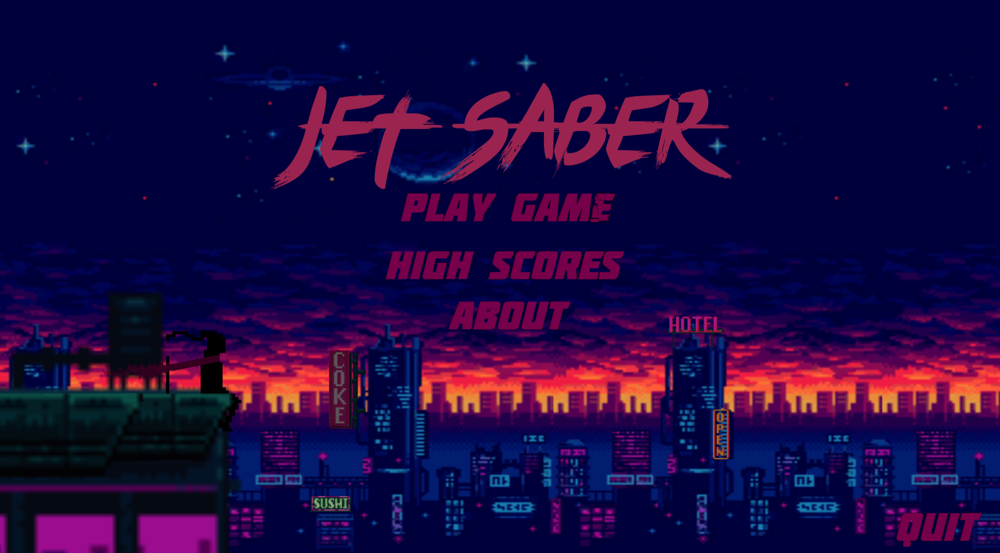
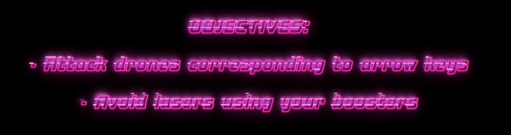
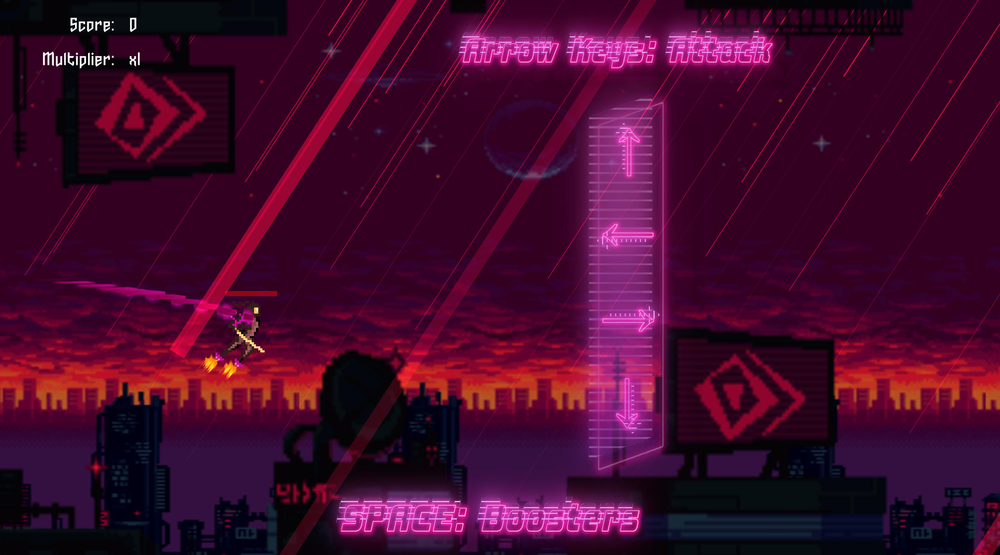
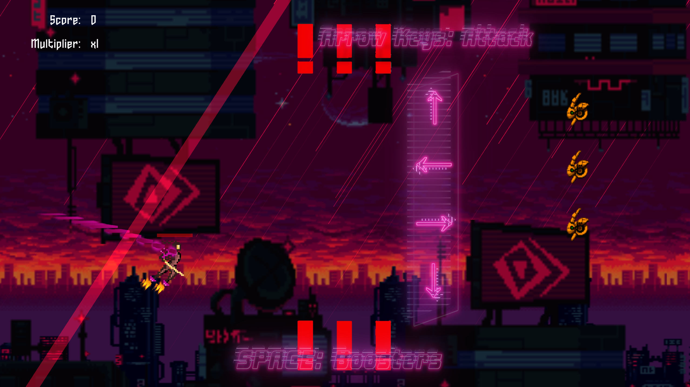
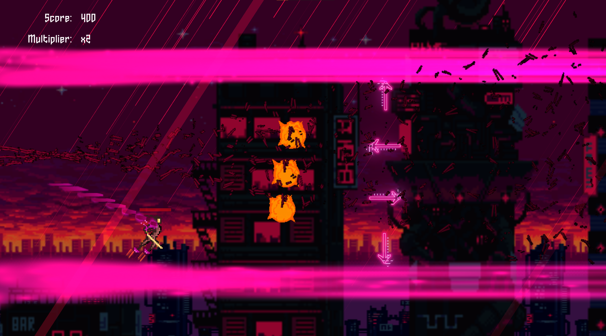

# JetSaber
A 2D game (made using Unity) that combines the similar movement of the game, Jetpack Joyride, with rhythmically timed enemies and events that correspond to music.

Further explanation (through a Game Design Document) of the game can be found under:
Assets/Documentation/CS583F2020_2DGDD_Pamelar_Reymond.docx

An executable of the game can be found under: 
Releases/JS1.0/CS583F2020_Pamelar_Reymond_Project_2B.exe

